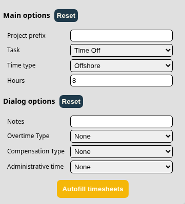

# Description

SuiteProjects Pro Timesheets Autofill is a simple extension which lets you
autofill repetetive data into multiple fields of SuiteProjects Pro timesheets.
If you're lazy like me and don't want to click through multiple windows to
enter the same thing over and over, this extension is for you!

# Installation and usage

To install the extension, follow below steps:

1. Pull the code from this repository to your device.
2. Go to `chrome://extensions/` in your Chrome browser.
3. Enable `Developer mode`.
4. Go to `My extensions` and click `Load unpacked`.
5. Select the `ts-autofiller` directory from your device.

To use the extension, simply click on its icon. You should see a popup like this:

